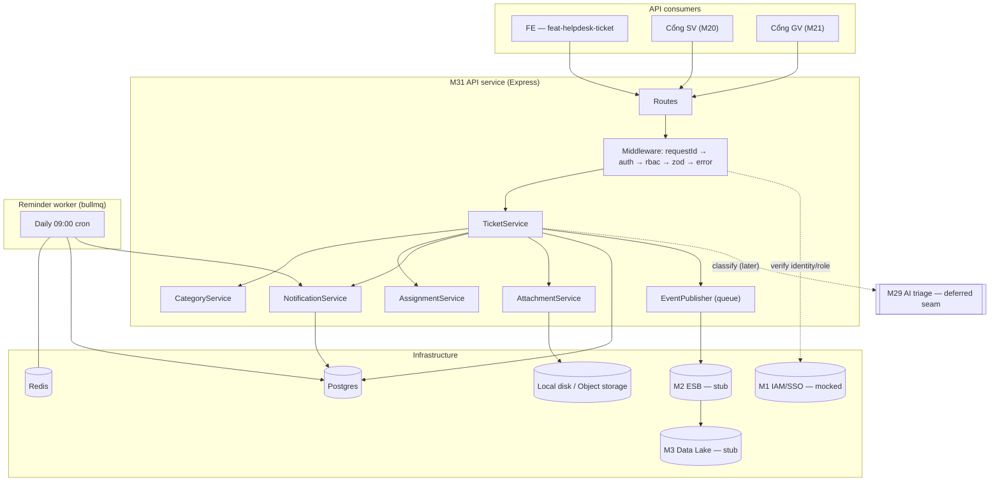
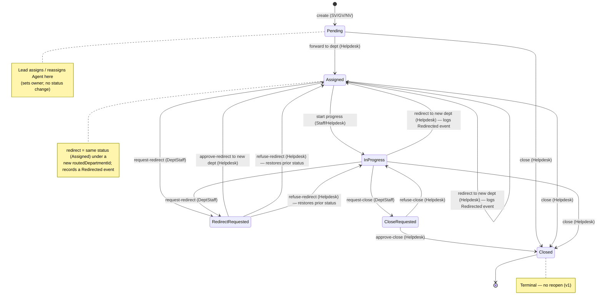
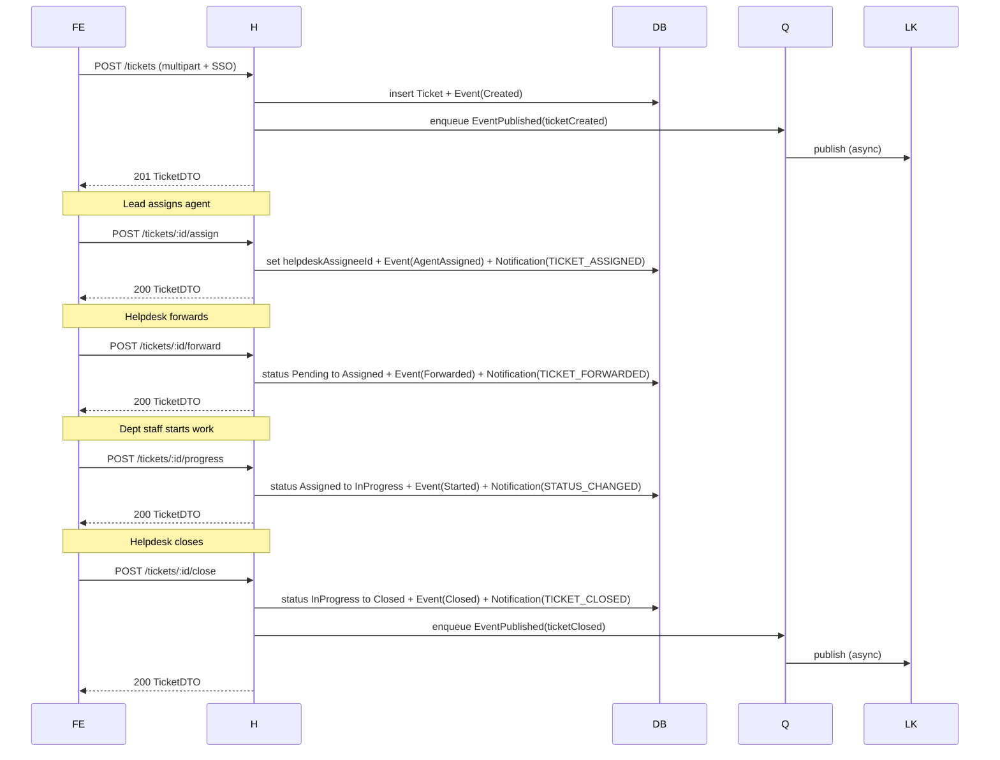
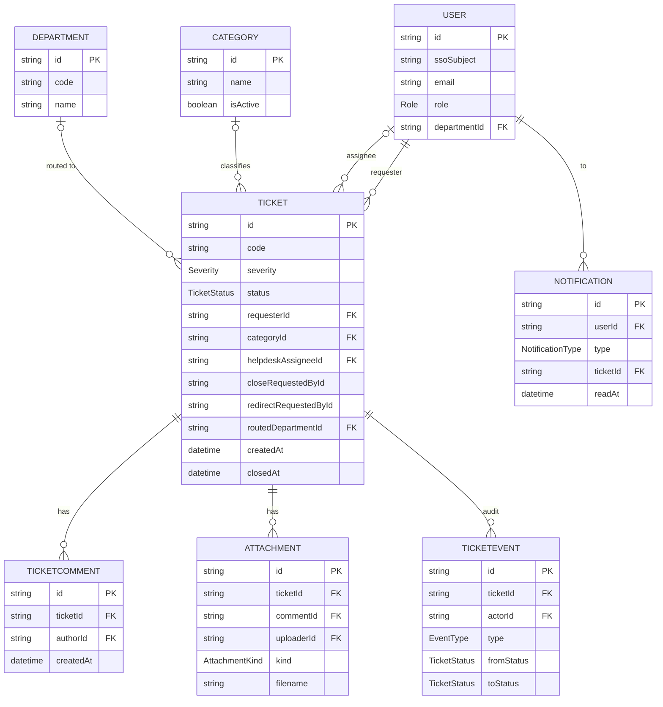

# Feature Plan (BE) — M31 Helpdesk / Ticket

| Field | Value |
|---|---|
| Module | **M31 — Helpdesk / Ticket** — Back-end |
| Sources | `feat-helpdesk-api/docs/brief.md`, `feat-helpdesk-ticket/docs/feature-plan.md` (prior round — API §5, data model §4) |
| Step | Process Step 3 — Feature Plan (`/sc:design --type api --persona-architect`) |
| Stack | Node 22 · Express 4 · Prisma 5 (Postgres) · Zod · `google-auth-library` (Google OAuth) · multer + Vercel Blob · bullmq (Redis) · pino · vitest |
| Reference repo | `feat-admission-plan/` — mirrored layout/tooling |
| Output of this step | **This document only** — no code yet (that is Step 6 `/sc:implement`) |

---

## A. Plan decisions (defaults — flag any to change before Step 6)

1. **Single Express app**, not a microservices split. The cron worker, API, and event publisher all run inside one process (bullmq worker as a sibling entry point under the same package). Matches `feat-admission-plan`.
2. **Folder structure mirrors `feat-admission-plan`**: `src/{routes,services,middleware,lib,config,types}` + `prisma/` + `tests/{unit,service,integration}` + `docker-compose.yml`.
3. **TypeScript** for the BE (Node 22, ES modules) — deviation from `feat-admission-plan` (which is JS-with-JSDoc), per direction. Dev runs via `tsx --watch`; prod build via `tsc → dist/` and `node dist/index.js`. Zod `z.infer` for derived request/DTO types; Prisma's generated client types flow end-to-end. `tsconfig.json` set to `"module": "esnext"`, `"moduleResolution": "bundler"`, `"strict": true`.
4. **Demo auth via email + password** → signed JWT in an `HttpOnly Secure SameSite=None` cookie (8 h lifetime, no refresh). Login (`POST /auth/login { email, password }`) bcrypt-checks against `User.passwordHash` seeded by `prisma/seed.ts` (per-persona passwords, one per mock identity). Logout clears the cookie; `GET /auth/me` lets the FE rehydrate on reload. **Google OAuth** (Authorization Code Flow via `google-auth-library`) ships alongside the password login and issues the same cookie (`GET /auth/google` + `/auth/google/callback`); the rest of the app keeps reading `req.user` only.
5. **EventPublisher**: a logger-backed implementation in dev; a queued (bullmq) outbound channel ready for ESB wiring later.
6. **Attachment storage adapter**: local disk in dev (`./uploads`); the `StorageAdapter` interface lets an object-storage adapter drop in later (§10 open item).
7. **Hosting target: Vercel** (serverless). Constrains a few of the defaults above:
   - `app.ts` is exported as a Vercel serverless function handler (catch-all route); no `app.listen()` in prod (it stays for local `tsx --watch`).
   - The bullmq **continuous worker becomes a Vercel Cron** invocation: `vercel.json` `crons:` schedules `POST /jobs/daily-reminder` (shared-secret guarded). The same handler in `jobs/daily-reminder.ts` is reused; local dev still runs the bullmq worker via `tsx`.
   - Managed **Postgres** (Vercel Postgres / Neon) + managed **Redis** (Upstash) — both serverless-safe (pooled connections; HTTPS for QStash if used).
   - **Attachment storage** in prod must be object storage (Vercel Blob / S3 / R2) — local disk only works locally; §K open item is now blocking for Step 5/6.
   - EventPublisher → either direct HTTPS push or Upstash **QStash**; the in-process bullmq queue is dev-only.

## B. Architecture overview

The service is a stateless Express API + a bullmq worker process, both reading/writing one Postgres DB and using Redis for the job queue. SSO identity comes in on every request; the service is the **lifecycle authority** for tickets.



### Folder structure

```
feat-helpdesk-api/
  docs/                          # brief, this feature-plan, impl-plan, test-design
  prisma/
    schema.prisma
    migrations/0001_create_m31_helpdesk/
  src/
    index.ts                     # API entry (binds Express)
    worker.ts                    # bullmq worker entry (reminder + event publisher)
    app.ts                       # Express app factory (exported for tests via supertest)
    config/env.ts                # zod-validated env
    middleware/                  # requestId, auth (cookie-JWT + mock fallback), rbac, zodValidate, error, multer
    routes/                      # tickets, categories, notifications, analytics, healthz
    services/                    # TicketService, CategoryService, AssignmentService,
                                 # NotificationService, AttachmentService, AnalyticsService
    lib/                         # logger.ts (pino), prisma.ts, ids.ts (cuid), envelope.ts, errors.ts,
                                 # storage/local.ts + storage/index.ts (adapter), events/publisher.ts
    types/                       # domain.ts — TS types mirroring prior FP §4 enums/DTOs; many derived from Zod via z.infer
    jobs/                        # daily-reminder.ts (cron def + handler)
  tests/
    unit/                        # pure helpers (status mapper, severity, scoping, zod schemas)
    service/                     # service-layer (TicketService etc.) against a test Prisma DB
    integration/                 # full HTTP via supertest against app.ts + test DB + faked Redis
  docker-compose.yml             # postgres:15 + redis:7 (mirrors feat-admission-plan)
  package.json
  tsconfig.json
  vitest.config.ts
  .env / .env.example
  .github/workflows/ci.yml
```

## C. Ticket lifecycle (state machine + transitions)



**Transition table** (server enforces; each row = one Prisma transaction that updates `tickets` + inserts a `ticket_events` row + optionally a `notifications` row):

| Action | Pre-status | Post-status | Actor role | Side effects |
|---|---|---|---|---|
| `create` | – | `Pending` | SV/GV/NV | `TicketEvent[Created]`; `EventPublisher.ticketCreated`. |
| `assignAgent` | `Pending` | `Pending` *(attribute change only)* | `HelpdeskLead` | sets `helpdeskAssigneeId`; `TicketEvent[AgentAssigned]`; notify Agent (`TICKET_ASSIGNED`). |
| `forward` | `Pending` | `Assigned` | Helpdesk | sets `routedDepartmentId`; `TicketEvent[Forwarded]`; notify dept staff (`TICKET_FORWARDED`). |
| `startProgress` | `Assigned` | `InProgress` | `DeptStaff` (own dept) / Helpdesk | `TicketEvent[Started]`; notify requester (`STATUS_CHANGED`). |
| `redirect` | `Assigned` \| `InProgress` | `Assigned` | Helpdesk | sets new `routedDepartmentId` (status returns to `Assigned`, keeps assignee); `TicketEvent[Redirected]` w/ from→to dept; notify new dept staff. |
| `overrideSeverity` | any non-Closed | unchanged | Helpdesk | updates `severity`; `TicketEvent[SeverityChanged]`. |
| `comment` | any non-Closed | unchanged | participants / Helpdesk | inserts `TicketComment` + `TicketEvent[Commented]`. |
| `close` | `Pending` \| `Assigned` \| `InProgress` | `Closed` | Helpdesk Lead **or** assigned Agent | sets `closedAt`; `TicketEvent[Closed]`; notify requester (`TICKET_CLOSED`); `EventPublisher.ticketClosed`. |

**Concurrency:** every transition reads the current status inside the transaction and rejects with **`409 conflict`** if it changed (optimistic guard). No reopen — `Closed` is terminal.

## D. Main-flow sequence (server perspective)

Legend: **FE** = FE / Portal · **H** = Helpdesk API · **DB** = Postgres · **Q** = bullmq (Redis) · **LK** = Data Lake (via ESB).



> Each `H->>DB:` write happens inside one Prisma transaction with the audit `TicketEvent` and the `Notification` row (per §C); the `BEGIN`/`COMMIT` pseudocode is dropped from the diagram because `;` is a statement separator in Mermaid's grammar.

## E. Data model (Prisma / Postgres)

**Conventions (match `feat-admission-plan`):** Prisma `provider = "postgresql"`; IDs `String @id @default(cuid())`; timestamps `createdAt @default(now())` + `updatedAt @updatedAt`; models PascalCase mapped via `@@map` to snake_case plural tables (`tickets`, `ticket_comments`, `attachments`, `categories`, `ticket_events`, `notifications`, `users`, `departments`). **Enum values use PascalCase** matching ISO labels (`Severity {Critical|High|Medium|Low}`, `TicketStatus {Pending|Assigned|InProgress|CloseRequested|RedirectRequested|Closed}`, `Role {SV|GV|NV|HelpdeskLead|HelpdeskAgent|DeptStaff|Admin}`, `NotificationType {TicketClosed|DailyReminder|TicketAssigned|TicketForwarded|StatusChanged|TicketCreated|TicketCommented|CloseRequested|CloseRefused|RedirectRequested|RedirectRefused}`, `EventType {Created|AgentAssigned|Forwarded|Redirected|Started|SeverityChanged|Commented|CloseRequested|CloseRefused|RedirectRequested|RedirectRefused|Closed}`).



**Indexes:** `tickets(status)`, `tickets(helpdesk_assignee_id, status)`, `tickets(routed_department_id, status)`, `tickets(requester_id)`, `tickets(created_at)`, `notifications(user_id, read_at)`, `ticket_events(ticket_id, created_at)`.
**Migration:** `0001_create_m31_helpdesk` (+ `.down.sql`) — creates all M31 tables; seed script for `departments` + default `categories`. Department routing is a manual Agent/Lead pick per ticket — there is no routing-rule table/entity.

## F. API contract (REST, base `/api/v1`)

**Canonical contract:** `feat-helpdesk-ticket/docs/feature-plan.md` §5 (kept in sync — same endpoints, envelope, statuses, scoping rules). Reproduced here only to call out the **server-side** rules:

- **Envelope:** every response is `{ data, error: null, requestId }` (success) or `{ data: null, error: { code, message, fields? }, requestId }` (failure).
- **Errors:** `400` Zod validation; `401` no/invalid SSO; `403` RBAC/ownership; `404`; `409` illegal state-machine transition (stale current status); `413` attachment too large; `422` Zod schema or business validation; `5xx` reserved for genuine server errors.
- **Server-derived scoping (never trust a client param):** `SV/GV/NV` → only own `requesterId`; `DeptStaff` → only `routedDepartmentId = caller.departmentId`; `HelpdeskAgent` → only `helpdeskAssigneeId = caller.id` on personal queues, all tickets on shared queues; `HelpdeskLead` & `Admin` → all.
- **`status` query** on `GET /tickets`: accepts CSV or repeated values from `{Pending,Assigned,InProgress,CloseRequested,RedirectRequested,Closed}`, **or** the convenience value `open` meaning every non-`Closed` state (i.e. `{Pending,Assigned,InProgress,CloseRequested,RedirectRequested}`).
- **Mutations** use Zod-validated request bodies; FormData on `POST /tickets` and `POST /:id/comments` (multer).

The full per-endpoint table — `POST /tickets`, `GET /tickets`, `GET /tickets/:id`, `POST /:id/{assign,forward,progress,close,request-close,approve-close,refuse-close,comments}`, `PATCH /:id/{severity,category}`, `GET /:id/{history,comments}`, `GET /attachments/:id`, `POST /attachments/upload-url` (Vercel Blob direct-upload token broker — auth-gated, the primary upload path), `GET/POST/PATCH/DELETE /categories[/:id]`, `GET/POST /notifications[/:id/read]`, `DELETE /notifications`, `GET /analytics/summary`, `GET /healthz`, the cron job endpoints `POST /jobs/daily-reminder` + `POST /jobs/blob-sweep` (both `JOB_SECRET`-guarded), and the Google-OAuth pair `GET /auth/google` + `GET /auth/google/callback` — lives in the canonical FP §5.

**Close-request workflow (BE-S17, 2026-06-11):** `POST /tickets/:id/request-close` (DeptStaff of routed dept — multipart proof comment + optional images → `CloseRequested`), `POST /tickets/:id/approve-close` (Lead/assigned-Agent → `Closed`), `POST /tickets/:id/refuse-close` (Lead/assigned-Agent, reason required → `InProgress`). Adds internal status `CloseRequested` (external `Processing`); event types `CloseRequested`/`CloseRefused`; notification types `CloseRequested`/`CloseRefused`.

**Redirect (BE-S18/S19, 2026-06-11):** **Direct (S18)** — `POST /tickets/:id/redirect` (Lead/assigned-Agent; `Assigned`/`InProgress` → `Assigned` against a different dept; reason required; keeps assignee; `EventType[Redirected]`). **Request (S19)** — `POST /tickets/:id/request-redirect` (DeptStaff of routed dept, reason only → `RedirectRequested`), `POST /tickets/:id/approve-redirect` (Lead/assigned-Agent picks the target dept → `Assigned`), `POST /tickets/:id/refuse-redirect` (reason → prior status). Adds internal status `RedirectRequested` (external `Processing`); event/notification types `RedirectRequested`/`RedirectRefused`; `Ticket.redirectRequestedById`.

**User-management endpoints (Admin-only — scope exceptions, 2026-06):**

| Method + path | Returns | Notes |
|---|---|---|
| `GET /users` | 200 `{ items, page, pageSize, total }` | Phase 13. Filters `role` / `departmentId` / `search`. Excludes soft-deleted (`isActive=false`). DTO never leaks `passwordHash` / `ssoSubject` / `googleId`. |
| `GET /users/:id` | 200 `User` \| 404 | Phase 13. Permissive on `isActive` (no 404 mid-navigation). |
| `POST /users` | 201 `User` | Phase 15. Institutional email only (`@ums.edu.vn`/`@dau.edu.vn`); name = letters+spaces; DeptStaff needs dept; password optional (blank ⇒ SSO-only). 409 on active-email dup; **revives** a deactivated-email row. |
| `PATCH /users/:id` | 200 `User` \| 404 \| 422 | Phase 16. Updates displayName/role/dept/password. **Email immutable.** |
| `DELETE /users/:id` | 200 `User` | Phase 16. Soft delete (`isActive=false`); 409 on self-target; history preserved. |

> These step outside the helpdesk's bounded context (user lifecycle normally lives in M1/IAM); built for the practice/demo per explicit product decisions. See the role-permission matrix + `caira-dau-helpdesk-scope` memory.

**Auth endpoints (demo build):**

| Method + path | Body | Returns | Notes |
|---|---|---|---|
| `POST /auth/login` | `{ username, password }` | 200 envelope `{ user }` + `Set-Cookie` JWT | 401 on bad credentials; rate-limited; opaque error message ("Sai tài khoản hoặc mật khẩu") so attackers can't enumerate. |
| `POST /auth/logout` | — | 200 empty envelope + `Set-Cookie` clearing | Idempotent; no 401 if cookie missing. |
| `GET /auth/me` | — | 200 envelope `{ user }` if cookie valid, 401 otherwise | The FE calls this on app boot to rehydrate `SessionProvider`. |
| `GET /auth/realtime-token` | — | 200 envelope `{ token }` (60 s HS256 JWT, `sub = userId`), 401 otherwise | `requireAuth`-gated; the FE hands this token to the Socket.IO server's handshake. See §G.1. |

### Middleware order

`requestId → pino-http (log) → cors (credentials: true, origin from env) → helmet → cookie-parser → body parser (json | multipart for upload routes) → auth (verify JWT cookie, attach req.user{id,role,departmentId}) → rbac (route-level capability check) → zodValidate (per route) → handler → error (envelope-shapes everything)`.

### Identity contract

`auth` middleware reads the `ums_session` cookie, verifies the JWT against `JWT_SECRET`, and hydrates `req.user`. `requireAuth` then **re-validates a cookie session against the DB on every request** (deactivated user rejected immediately; role/dept refreshed from the DB source of truth). `/auth/login`, `/auth/google`, and `/auth/google/callback` run **before** the auth gate (they issue the cookie); `/healthz` and `/docs/*` remain public. Both the password login and **Google OAuth** (`google-auth-library`) resolve to the same `req.user` shape — the rest of the app is unchanged.

## G. Notifications & the daily 09:00 reminder

- **In-app only, persisted as `Notification` rows.** Endpoints: `GET /notifications` (caller's own, unread-first, paginated); `POST /notifications/:id/read`.
- **Triggered by the lifecycle**: `TICKET_CLOSED` to requester (close handler), `TICKET_ASSIGNED` to agent (assign handler), `TICKET_FORWARDED` to dept staff (forward handler), optional `STATUS_CHANGED` to requester (progress handler). All inserted in the same transaction as the status change.
- **Daily reminder** — bullmq repeatable job, cron `0 9 * * 1-5`, TZ `Asia/Ho_Chi_Minh`, public-holiday skip via `lib/calendar.js` (config file of dates). For every Helpdesk agent with ≥1 backlog ticket (`status IN {Pending, Assigned}`, `helpdeskAssigneeId = agent.id`), insert one `DAILY_REMINDER` notification with `payload = { tickets: [{id, code, severity, ageDays}] }`. **Idempotent** via dedupe key `reminder:{agentId}:{YYYY-MM-DD}` stored in Redis (24h TTL).
- **Runtime split**: local dev runs `worker.ts` as a long-running `tsx --watch` process consuming the bullmq queue. On **Vercel**, `vercel.json` `crons:` hits `POST /jobs/daily-reminder` (shared-secret-guarded) on the same `0 9 * * 1-5` schedule — the handler in `jobs/daily-reminder.ts` is the single source of truth and is invoked by both runtimes (long-running consumer locally, scheduled serverless function in prod).

### G.1 Realtime push (Socket.IO) for the notification bell

Vercel serverless functions can't hold a WebSocket open, so live delivery runs through a **separate always-on service** (`feat-helpdesk-realtime` / repo `UMS-HELPDESK-SOCKET`, deployed on Render) that owns the socket connections. The BE never holds a socket — it only *pushes*.

**Capture, not call-site edits.** A Prisma `$use` middleware (`lib/prisma.ts`) records, into a per-request `AsyncLocalStorage` sink (`realtimeSink` in `lib/realtime.ts`): every created `Notification`, and whether any `Ticket` row was written. The `realtimeCollect` middleware runs each request inside that sink and, **only after the response finishes with status < 400** (so the transaction committed), emits. A rolled-back/errored request emits nothing — no phantom events. This avoids touching the ~25 ticket/notification write sites.

**Events emitted:**

| Event | Target | When | FE reaction |
|---|---|---|---|
| `notification:new` | the recipient's `user:<id>` room | a `Notification` row is created | prepend to `['notifications']` + toast; also `invalidate(['ticket', ticketId])` so the open detail (comments/status) updates live |
| `tickets:changed` | **broadcast** (all clients) | any `Ticket` write (create/update/delete) | `invalidate(['tickets'])` (queues/lists) + analytics summary → live queues + dashboard |
| `categories:changed` | **broadcast** | category create/update/delete (emitted explicitly in `routes/categories.ts`) | `invalidate(['categories'])` |

**Fan-out:** `emitToUsers()` / `emitBroadcast()` do a fire-and-forget `POST {REALTIME_EMIT_URL}/emit` (`x-emit-secret` header; `{userIds}` or `{broadcast:true}`). Best-effort: never blocks/fails a request, **no-op when `REALTIME_EMIT_URL`/`REALTIME_EMIT_SECRET` are unset** (local/test/cron). **Vercel gotcha:** the emit is wrapped in `@vercel/functions` `waitUntil` — without it the frozen-after-response function kills the fetch before it reaches Render (events silently never delivered).

**Handshake auth:** the FE fetches `GET /auth/realtime-token` (rides the session cookie via the proxy), then connects with that 60 s JWT. The realtime server verifies it with the **dedicated `REALTIME_JWT_SECRET`** (HS256, reads `sub`; NOT the session `JWT_SECRET` — least privilege) and joins the socket to room `user:<id>`.

**FE freshness:** notifications are **socket-driven** when realtime is configured — mount fetch (history) + `notification:new` push + reconnect-invalidate + optimistic mutations. When the realtime trio (`REALTIME_EMIT_URL`/`REALTIME_EMIT_SECRET`/`REALTIME_JWT_SECRET`) is unset or the socket is fully down (sleeping Render), the FE falls back to a **30 s poll** so new items still surface; otherwise they arrive on the next reconnect/mount, so keep the realtime server warm. A pure comment doesn't write the `Ticket` row, so it fires `notification:new` (detail updates) but not `tickets:changed` (queue rows unchanged).

**Env:** `REALTIME_EMIT_URL`, `REALTIME_EMIT_SECRET` (= realtime server's `EMIT_SECRET`), `REALTIME_JWT_SECRET` (= realtime server's `REALTIME_JWT_SECRET`).

## H. Dependencies (Node, ES modules)

- **Runtime:** `express`, `@prisma/client`, `prisma` (dev), `zod`, `google-auth-library` (Google OAuth — `passport`/`passport-google-oauth20` remain in `package.json` but are **unused**), `multer` + `@vercel/blob` + `@vercel/functions` (Blob direct upload + `waitUntil`), `swagger-ui-express`, `bullmq` + `ioredis`, `helmet`, `express-rate-limit`, `pino`, `pino-http`, `pino-pretty` (dev), `cors`, `cuid`/`@paralleldrive/cuid2`, `date-fns` + `date-fns-tz` (TZ math for the holiday calendar).
- **Dev/test (TypeScript toolchain):** `typescript`, `tsx` (dev/watch entry), `@types/node`, `@types/express`, `@types/multer`, `@types/supertest`, `vitest`, `supertest`, `@vitest/coverage-v8`, `eslint`, `@typescript-eslint/parser`, `@typescript-eslint/eslint-plugin`, `eslint-config-prettier`, `prettier`. Test DB: ephemeral Postgres via the same `docker-compose.yml`; a `tests/helpers/test-db.ts` truncates between tests.

## I. Non-functional requirements

- **Security:** auth required everywhere except `/healthz`, `/docs/*`, and `/auth/login` itself; RBAC enforced at route + service layer (defence in depth); helmet; per-route rate limits on `POST /auth/login`, `POST /tickets`, and `POST /:id/comments`; passwords stored as bcrypt hashes (cost ≥ 10); JWT signed with `JWT_SECRET` (≥ 32 random bytes, no fallback), `HttpOnly Secure SameSite=None` cookie scoped to the BE origin; attachments — MIME allowlist (images: jpg/png/webp/gif; docs: pdf/doc/docx/xls/xlsx), ≤10 MB, ≤5 files, stored outside webroot, streamed download with authz, virus-scan hook for later; Zod validation on every mutation; **no passwords, JWT secrets, or PII in logs**; SQL safety via Prisma parameterised queries.
- **Observability:** pino structured logs; `requestId` generated by the requestId middleware, propagated to logger child + response envelope; the `TicketEvent` audit table is the in-DB audit log; `GET /healthz` for liveness; analytics summary endpoint feeds the FE module dashboard.
- **Reliability:** status transition + audit row + notification row in **one Prisma transaction**; optimistic guard on current status → `409` on stale write; bullmq retries (max 3, exponential) for the reminder job + event publisher; idempotent reminder via dedupe key; graceful shutdown drains the queue.
- **Performance:** list endpoints paginated (default 20, max 100); the indexes above; attachment streaming (not buffered); the reminder job batches one DB query per agent group.
- **i18n:** error `message` fields in Vietnamese (the API is internal); `code` stable ASCII for clients to map.

## I.1 Security — implemented controls (status)

What's actually in place (verified in code), so future work knows the baseline:

**Authentication**
- Session = signed **JWT in an HttpOnly + Secure + SameSite cookie** (`AuthService`), made **first-party** via the FE same-origin proxy (fixes Safari/iOS ITP).
- Passwords **bcrypt**-hashed; `POST /auth/login` is **rate-limited** and returns an **opaque** error (no account enumeration).
- **Google SSO** (OAuth code flow): signed-JWT `state`, ID-token verified via Google JWKS, `email_verified` required, **domain allowlist**.
- **Session re-validation (added 2026-06):** for a real (cookie) session, `requireAuth` **re-checks the user against the DB on every request** — a **deactivated/deleted user is rejected immediately** (not after the 8 h token), and `req.user` role/department are **refreshed from the DB** so admin changes take effect at once. The mock-header path (dev/test only) is exempt.

**Authorization**
- **RBAC at route + service layer** (defence in depth). Per-ticket guards on **every read *and* write**: `assertCanViewTicket` (detail/history/comments/attachment download) and `assertCanPerform` (state-machine transitions: role + dept-match for DeptStaff, assignee-match for Agent). A stale client view grants no power — the server is the boundary.
- Sensitive user fields (`passwordHash`, `googleId`, `ssoSubject`) **stripped from DTOs**. Admin-only user CRUD (`requireRole('Admin')`); email immutable; no self-delete.

**Input / transport / data**
- **Zod** validation on every mutation; **Prisma parameterised** queries (no SQLi); React auto-escaping (no `dangerouslySetInnerHTML`).
- Uploads (multer path): **MIME allowlist + magic-byte content sniffing** (rejects a spoofed Content-Type — `lib/upload-validation.ts`), **≤10 MB, ≤5 files**, a pluggable **virus-scan hook** (no-op default, `setVirusScanner`), stored outside webroot, streamed download with authz. The Vercel-Blob upload-url broker is **auth-gated** (session cookie). Direct-to-Blob uploads (which the BE never buffers) are validated by `validateBlobAttachment` — a **range-fetch of the header** runs the same allowlist + magic-byte sniff and verifies the **true size** from `Content-Range` (the client-declared size is untrusted); full virus scanning still needs the whole file, so the no-op hook is skipped there.
- **Orphan-Blob GC** (`jobs/blob-sweep.ts`, its own `0 3 * * *` cron): the direct-upload flow writes to Blob *before* the ticket/comment that references it, so an abandoned upload dangles; the sweep lists the `m31/` prefix and deletes blobs older than the 1 h grace window that no `Attachment` row references (`JOB_SECRET`-guarded; no-op unless `STORAGE_DRIVER=blob` + `BLOB_READ_WRITE_TOKEN` set).
- **Download disposition:** `GET /attachments/:id` serves raster images + PDFs **`inline`** (sandboxed preview — the allowlist excludes HTML/SVG, `nosniff` set globally by helmet) and everything else as **`attachment`** (forced download).
- **Helmet** (incl. CSP); **CORS** scoped with credentials; HTTPS (Vercel/Render).
- **Realtime:** short-lived (60 s) handshake JWT signed with a **dedicated `REALTIME_JWT_SECRET`** (least privilege); `/emit` guarded by a shared secret; broadcast events carry **only "changed" signals, no data**; per-user payloads go to that user's room.
- Audit: `TicketEvent` table; pino logs with `requestId`; **no passwords/secrets/PII in logs**.

**Known gaps / deferred** (tracked):
- **Next.js major upgrade** (FE) — `next@14` has high-severity advisories fixed only in `next@16` (breaking); a separate migration, deferred.
- Wire a **real** virus scanner into the hook (currently no-op); content-sniff the Blob-direct upload path (BE never sees those bytes).
- Client-side **localStorage** holds some lists (e.g. admin user directory) ~24 h (wiped on logout); no MFA; rate limits only on a few endpoints.

*(Done/decided: IDOR sweep — no gaps found, all id-addressed endpoints scoped, locked by `scoping.test.ts`; DeptStaff scoping fixed via per-request DB re-validation; upload allowlist + magic-byte sniffing + virus-scan hook; upload-url broker auth-gated; **Google Client Secret — reviewed, not exposed → no rotation needed**; **dependency audit — BE multer + undici (high) fixed, FE + realtime `ws` DoS (high) fixed, all prod-dep highs cleared except the deferred Next upgrade; 2 non-exploitable transitive moderates accepted (gaxios→uuid, no `buf` path)**.)*

## J. Risks & mitigations (technical)

| Risk | Mitigation |
|---|---|
| Concurrent Helpdesk actions race the state machine | Transaction + optimistic current-status check → `409`. |
| Attachment abuse (size/type/malware) | Size/type/count caps, storage quota, scan hook, authz on download. |
| Reminder missed or duplicated | bullmq repeatable + monitoring; idempotent dedupe key per agent/day. |
| Data-lake coupling slows ticket ops | Async event publish via queue; failures isolated. |
| Category delete with live tickets | Block delete or soft-delete + reassign guard (categories are a flat list — no child categories). |
| IAM role staleness | Resolve role from SSO token each request; periodic user sync. |
| Long-running Prisma migrations during deploy | Migrations are additive on first ship (greenfield); future schema changes go through a separate review. |

## K. Open items for review (Tech Lead)

1. **Reminder backlog set:** v1 = `{Pending, Assigned}` (excludes `InProgress`, following ISO §8 literally). Include `InProgress` so Helpdesk doesn't forget to chase stale department work?
2. **Attachment storage adapter for prod:** local-disk works in dev; pick the production adapter (object storage / Drive / on-prem NFS) at Step 5/6.
3. **Ticket `code` format:** default `HD-YYYY-NNNNNN`. Confirm format + monotonic sequence source (Postgres sequence vs Redis counter vs `cuid2` slug).
4. **Notification fanout for high-severity tickets:** ISO doesn't require it; future enhancement.
5. **Soft-delete vs hard-delete for the (flat) category list.**

## L. Rollback plan

- Prisma migration `0001_create_m31_helpdesk` has a matching `.down.sql` (drops M31 tables only — no shared tables touched). `prisma migrate resolve --rolled-back` + manual down for emergency.
- Feature flag **`HELPDESK_ENABLED`** to disable all routes (returns `503`) without a redeploy.
- The bullmq repeatable reminder job can be disabled by removing the repeatable + draining the queue.
- Deploy-by-tag rollback per the team release flow (process §6.5). Practice mode stops at Step 7 — no real rollback drill.

## M. Epic / Story decomposition (Jira stand-in)

**Epic:** `M31 (BE) — Helpdesk / Ticket service` (link: this Feature Plan).

| Story | Title | Core AC focus |
|---|---|---|
| BE-S1 | Project scaffold + envelope + healthz + auth/RBAC middleware | mock-SSO middleware sets `req.user`; rbac middleware rejects with `403`; envelope shape covers success + error; `GET /healthz` returns `200`. |
| BE-S2 | Prisma schema + migration + seed (depts, categories) | `0001_create_m31_helpdesk` migration up/down clean; seed loads departments + default categories. |
| BE-S3 | Categories CRUD | Admin-only; delete guard (live tickets); 422 on duplicate name. |
| BE-S4 | Ticket create + list + detail (read paths) | server-derived scoping per role; status=open + multi-status filter; attachments upload via multer; envelope errors. |
| BE-S5 | State machine: assign / forward / redirect / progress / close + severity override | one Prisma transaction per transition; `409` on stale current-status; audit `TicketEvent` row inserted; correct role gating. |
| BE-S6 | Comments + comment attachments + history endpoint | participants/Helpdesk only; `TicketEvent[Commented]`; `GET /:id/history` ordered by `createdAt`. |
| BE-S7 | In-app notifications: store + list + mark-read + lifecycle inserts | TICKET_CLOSED / ASSIGNED / FORWARDED / STATUS_CHANGED inserted in the transition transaction; read-only of caller's own. |
| BE-S8 | Daily 09:00 reminder worker (bullmq) | cron `0 9 * * 1-5` TZ Asia/Ho_Chi_Minh; holiday-skip; idempotent dedupe; per-agent backlog query is one round-trip. |
| BE-S9 | EventPublisher (logger adapter) + ticket lifecycle events | non-blocking publish; retries on failure; logger adapter prints the event shape; interface ready for ESB adapter. |
| BE-S10 | Analytics summary endpoint | counts by severity/category/status, avg handling time; RBAC: Helpdesk/Admin/BGH only. |
| BE-S11 | Demo auth: login / logout / me + cookie-JWT middleware | `ums_session` HttpOnly cookie; rate-limited login; opaque 401; idempotent logout. |
| BE-S12 | Google OAuth login (Authorization Code Flow) | signed-state CSRF; domain allowlist; upsert by googleId/email; **deactivated accounts blocked from re-login** (2026-06-10). |
| BE-S13 | Admin user directory (read-only) | Admin-only `GET /users[/:id]`; filters + pagination; DTO projection (no PII). |
| BE-S15 | Admin user creation *(scope exception)* | institutional email; name rule; DeptStaff dept; optional password; revive deactivated email. |
| BE-S16 | Admin user update + soft delete *(scope exception)* | PATCH (email immutable); soft delete `isActive=false`; no self-delete; deactivated hidden from list. |
| BE-S17 | DeptStaff close request workflow | `CloseRequested` status; request (proof comment+images) / approve / refuse (reason); dept-scope + assignee guards; notifications each step. |
| BE-S18 | Agent/Lead direct redirect | re-route Assigned/InProgress → new dept (reason); resets to Assigned, keeps assignee; `Redirected` event. |
| BE-S19 | DeptStaff redirect request workflow | `RedirectRequested` status; request (reason, no target) / approve (reviewer picks dept) / refuse (reason → prior status); notifications each step. |

---

*Traceability: ISO M31 → BE Brief → this Feature Plan → Stories (BE-S1…BE-S16) → Tasks. Practice mode: stop at Step 7 (Test). BE-S12–S16 added 2026-06 (auth + user management); BE-S15/S16 are explicit scope exceptions documented inline.*
